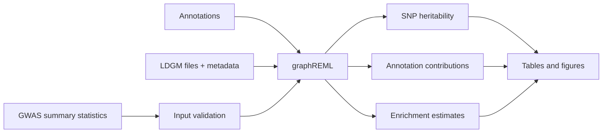

# Running graphREML on a PBS HPC Cluster

A reproducible, GitHub-ready guide to heritability partitioning and annotation enrichment with the Python implementation of [GraphLD](https://oclb.github.io/graphld/).

> **Important:** GraphLD command-line options and data layouts can differ between versions. Treat the installed `--help` output, repository `Makefile`, metadata, and official documentation as authoritative for your installation.

## Contents

- [What graphREML does](#what-graphreml-does)
- [Quick start](#quick-start)
- [Requirements](#requirements)
- [Project layout](#project-layout)
- [Install and record the environment](#install-and-record-the-environment)
- [Download reference data](#download-reference-data)
- [Prepare summary statistics](#prepare-summary-statistics)
- [Population and ancestry](#population-and-ancestry)
- [Run a chromosome pilot](#run-a-chromosome-pilot)
- [PBS script](#pbs-script)
- [Validate and monitor the job](#validate-and-monitor-the-job)
- [Scale to chromosomes 1–22](#scale-to-chromosomes-122)
- [Interpret results](#interpret-results)
- [Troubleshooting](#troubleshooting)
- [Reproducibility checklist](#reproducibility-checklist)
- [Citation and data use](#citation-and-data-use)

## What graphREML does

graphREML uses GWAS summary statistics, genomic annotations, and sparse LD reference data to estimate:

- SNP heritability captured by the analysed variants.
- Annotation-specific heritability contributions.
- Enrichment or depletion of heritability in functional categories.

It does not identify a causal gene or variant, estimate an individual's disease risk, or prove that an annotation is biologically causal.



## Quick start

Replace `/path/to/project` and `trait` with your own values.

```bash
git clone https://github.com/oclb/graphld.git
cd graphld
uv sync

# Check the installed interface. This version may not implement --version.
uv run graphld --help
uv run graphld reml --help
uv run python -c 'from importlib.metadata import version; print(version("graphld"))'

# Download from the target documented for your installed version.
cd data
make download_precision
cd ..

# Submit after editing and validating run_graphreml.pbs.
qsub run_graphreml.pbs
```

Do not submit until the LDGM filenames, metadata, population, annotations, and GWAS format are consistent.

## Requirements

- PBS/Torque or a compatible HPC scheduler.
- `uv`, or another supported Python environment manager.
- GraphLD and its dependencies.
- SuiteSparse/scikit-sparse if required by your cluster installation.
- GWAS summary statistics permitted for the planned analysis.
- Matching GraphLD annotations, LDGM files, SNP lists, and metadata.

Install software and download data on a login node with internet access. Compute nodes often cannot access the internet.

## Project layout

```text
graphreml-project/
├── data/
│   ├── sumstats/
│   │   └── trait.sumstats
│   ├── annot/
│   └── ldgms/
│       └── metadata.csv
├── results/
├── logs/
├── run_graphreml.pbs
├── pyproject.toml
└── uv.lock
```

Set paths once in your shell:

```bash
export PROJECT_DIR="/path/to/graphreml-project"
export SUMSTATS="$PROJECT_DIR/data/sumstats/trait.sumstats"
export ANNOT_DIR="$PROJECT_DIR/data/annot"
export LDGM_DIR="$PROJECT_DIR/data/ldgms"
export METADATA="$LDGM_DIR/metadata.csv"
export RESULTS_DIR="$PROJECT_DIR/results"
```

## Install and record the environment

```bash
cd "$PROJECT_DIR"
uv sync

uv run graphld --help
uv run graphld reml --help
uv run python -c 'from importlib.metadata import version; print(version("graphld"))'

git rev-parse HEAD
uv pip freeze > graphld-environment.txt
```

The top-level CLI may not support `--version`; an error stating that `cmd` is required means the program is installed but does not recognize that option. Use the commands above instead.

## Download reference data

Inspect the repository Makefile before downloading:

```bash
cd "$PROJECT_DIR/data"
sed -n '1,260p' Makefile
```

Use the target documented for your version. In the environment documented here, a full population precision download was used:

```bash
make download_precision
```

Some releases also provide `make download_reml`. Do not assume that two targets produce interchangeable layouts. After downloading, inspect:

```bash
ls -lh ldgms | head
head -5 ldgms/metadata.csv
cat rename_ukbb_files.sh 2>/dev/null || true
```

The rename script, when present, standardizes downloaded UKBB filenames. It does not convert UKBB LDGM data into EUR LDGM data and must not be used to create artificial population matches.

### Reference-data consistency

Before a run, confirm that:

1. The selected population appears in the SNP-list/metadata.
2. The required population-specific edge-list exists.
3. The annotation chromosome files exist.
4. Metadata points to files actually present on disk.

For example, for a EUR chromosome 3 pilot:

```bash
ls -lh "$LDGM_DIR"/*EUR.edgelist | head
ls -lh "$ANNOT_DIR"/baselineLD.3.annot
```

If metadata requires `*.EUR.edgelist` but only `*.UKBB.edgelist` exists, stop. Do not rename files manually and do not switch to `UKBB` unless the corresponding SNP-list has a valid UKBB allele-frequency column.

## Prepare summary statistics

Inspect the input:

```bash
head -3 "$SUMSTATS"
wc -l "$SUMSTATS"
```

A common LDSC-style layout is:

```text
SNP    A1    A2    Beta    se    N
```

Confirm the exact required columns with:

```bash
uv run graphld reml --help
```

Check numeric sample sizes, removing possible carriage returns:

```bash
awk -F'\t' '
NR > 1 {
    n=$6; gsub(/\r/, "", n)
    if (n == "" || n <= 0 || n !~ /^[0-9]+([.][0-9]+)?$/)
        print "Invalid N at line", NR, ":", n
}' "$SUMSTATS" | head
```

Summarize variant-specific `N`:

```bash
awk -F'\t' '
NR > 1 {
    n=$6+0; count++; total+=n
    if (count==1 || n<min) min=n
    if (count==1 || n>max) max=n
}
END {
    print "Rows with N:", count
    print "Minimum N:", min
    print "Maximum N:", max
    if (count) print "Mean N:", total/count
}' "$SUMSTATS"
```

Meta-analyses often have variant-specific sample sizes. Do not replace them with the total sample size unless the GraphLD documentation explicitly requires it.

## Population and ancestry

`--population` selects the LD reference population. It does not change the ancestry of the GWAS.

| GWAS ancestry | Reference choice |
|---|---|
| European-only | `EUR` |
| East-Asian-only | `EAS` |
| Other single ancestry | Matching available reference |
| Multi-ancestry | Prefer ancestry-specific analyses; otherwise label the reference-based analysis explicitly |

For a multi-ancestry meta-analysis analysed with `--population EUR`, write that the estimate is conditional on the EUR LD reference. Do not describe it as ancestry-neutral.

## Run a chromosome pilot

Begin with one chromosome. A pilot tests the software, input format, annotation files, LDGM data, metadata, memory, and scheduler configuration before an expensive genome-wide run.

```bash
mkdir -p "$RESULTS_DIR/chr3"
```

A chromosome 3 result is not a genome-wide heritability estimate.

## PBS script

Save this as `run_graphreml.pbs` and edit paths, population, module names, and resources.

```bash
#!/bin/bash
#PBS -N graphreml_chr3
#PBS -l select=1:ncpus=1:mem=32gb
#PBS -l walltime=04:00:00
#PBS -j oe

set -euo pipefail

PROJECT_DIR="/path/to/graphreml-project"
SUMSTATS="$PROJECT_DIR/data/sumstats/trait.sumstats"
ANNOT_DIR="$PROJECT_DIR/data/annot"
METADATA="$PROJECT_DIR/data/ldgms/metadata.csv"
RUN_DIR="$PROJECT_DIR/results/chr3"
OUTPUT="$RUN_DIR/trait_chr3.tsv"
POPULATION="EUR"

cd "$PROJECT_DIR"
mkdir -p "$RUN_DIR"

# Change or remove this line according to your HPC system.
module load suitesparse/7.11.0

for f in "$SUMSTATS" "$METADATA"; do
    if [[ ! -s "$f" ]]; then
        echo "ERROR: missing input: $f" >&2
        exit 1
    fi
done

[[ -d "$ANNOT_DIR" ]] || { echo "ERROR: missing annotations" >&2; exit 1; }

# Example EUR pilot check. Adapt to your metadata and chromosome.
if [[ "$POPULATION" == "EUR" ]] && ! compgen -G "$PROJECT_DIR/data/ldgms/*EUR.edgelist" > /dev/null; then
    echo "ERROR: no EUR edge-list found" >&2
    exit 1
fi

if [[ -e "$OUTPUT" ]]; then
    echo "ERROR: output already exists: $OUTPUT" >&2
    exit 1
fi

command -v uv >/dev/null || { echo "ERROR: uv is not available in PBS" >&2; exit 1; }

{
    echo "Host: $(hostname)"
    echo "Start: $(date)"
    uv --version
    module list 2>&1 || true
} > "$RUN_DIR/run_metadata.txt"

uv run graphld reml \
    "$SUMSTATS" \
    "$OUTPUT" \
    --annot-dir "$ANNOT_DIR" \
    --metadata "$METADATA" \
    --population "$POPULATION" \
    --chromosome 3 \
    --run-in-serial \
    --verbose \
    > "$RUN_DIR/graphreml.out" \
    2> "$RUN_DIR/graphreml.err"

echo "End: $(date)" >> "$RUN_DIR/run_metadata.txt"
echo "Completed: $OUTPUT"
```

Validate the shell syntax and CLI options before submission:

```bash
bash -n run_graphreml.pbs
uv run graphld reml --help
qsub run_graphreml.pbs
```

## Validate and monitor the job

```bash
qstat -u "$USER"
ls -lah "$RESULTS_DIR/chr3"
tail -f "$RESULTS_DIR/chr3/graphreml.out"
tail -f "$RESULTS_DIR/chr3/graphreml.err"
```

After completion:

```bash
test -s "$RESULTS_DIR/chr3/trait_chr3.tsv" && echo "Non-empty output"
head -20 "$RESULTS_DIR/chr3/trait_chr3.tsv"
```

Expected files include:

```text
trait_chr3.tsv
graphreml.out
graphreml.err
run_metadata.txt
pbs.log
```

## Scale to chromosomes 1–22

Only scale up after the pilot succeeds. Use a separate output directory and file for each chromosome. Use a PBS array or one submitted job per chromosome according to local scheduler policy.

```bash
for chr in $(seq 1 22); do
    mkdir -p "$RESULTS_DIR/chr${chr}"
done
```

Check every chromosome for a non-empty output, successful completion, and absence of fatal tracebacks before summarizing results.

## Interpret results

Present results in a table containing:

| Field | Meaning |
|---|---|
| SNP heritability | Heritability captured by the analysed SNPs under the model |
| Annotation contribution | Estimated heritability associated with an annotation |
| Enrichment | Annotation heritability fraction relative to its SNP fraction |
| Standard error | Uncertainty of the estimate |
| P-value or confidence interval | Statistical evidence and precision |

An enrichment above 1 indicates more heritability than expected from the annotation's genomic size. It is not proof of causality. For a multi-ancestry GWAS with EUR LD, report the EUR reference explicitly.

A common figure is a dot-and-whisker plot of enrichment with 95% confidence intervals and a vertical reference line at 1.

## Troubleshooting

| Error | Likely cause | Action |
|---|---|---|
| `the following arguments are required: cmd` | `--version` is unsupported | Use `graphld --help`, `graphld reml --help`, and Python package metadata. |
| `unrecognized arguments: --annotations` | Incorrect CLI option | Check `graphld reml --help`; use `--annot-dir` if supported. |
| PBS output path does not exist | Run directory was not created | Run `mkdir -p` before `qsub`. |
| Missing `.EUR.edgelist` | Metadata and downloaded reference layout disagree | Inspect version, Makefile, metadata, and download target; do not rename files. |
| `UKBB column not found in snplist` | No UKBB allele-frequency column | Use a population supported by the SNP-list and matching edge-list. |
| Invalid `N` values | Wrong delimiter or hidden `\r` characters | Inspect with `cat -A`; remove carriage returns and confirm the format. |
| `uv` unavailable in PBS | Batch environment differs from login shell | Load or export `uv` inside the PBS script. |
| Output already exists | Protective overwrite check | Use a new run directory or deliberately remove the old output. |
| Job reaches walltime | Resources too small for the model | Validate on one chromosome, then increase walltime/memory or parallelize. |

## Reproducibility checklist

Save the following with every analysis:

- GraphLD version and Git commit.
- `uv.lock` or equivalent environment lock file.
- Exact PBS script and command.
- Summary-statistics checksum.
- Annotation and LDGM release information.
- Metadata and selected population.
- Variant counts before and after filtering.
- Scheduler resource requests.
- Standard output, standard error, and convergence diagnostics.

```bash
sha256sum "$SUMSTATS" "$METADATA" > input_checksums.sha256
git rev-parse HEAD > graphld_commit.txt
uv pip freeze > graphld-environment.txt
```

## Citation and data use

Cite GraphLD/graphREML, the GWAS source, annotation resource, and LD reference resource. Follow the original GWAS data-use restrictions.
